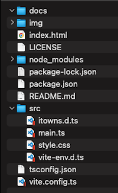

# itowns-starter


Start iTowns easily.  
- [iTowns v2.38.2](https://github.com/iTowns/itowns)  
- [TypeScript v4.8.2](https://www.typescriptlang.org)  
- [Vite v3.1.0](https://vitejs.dev)  
- node v18.1.0
- npm v8.8.0

<br>

## Usage



<br>

Install package
```bash
npm install
```

<br>

build
```bash
npm run build
```

<br>

dev
```bash
npm run dev
```

---

<br>
<br>


<br>

## License
MIT

Copyright (c) 2022 Yasunori Kirimoto

<br>

---

<br>

### Japanese

<br>

# iTowns スターター


iTownsを手軽に始める
- [iTowns v2.38.2](https://github.com/iTowns/itowns)  
- [TypeScript v4.8.2](https://www.typescriptlang.org)  
- [Vite v3.1.0](https://vitejs.dev)  
- node v18.1.0
- npm v8.8.0

<br>

##  使用方法


<br>

パッケージインストール

```bash
npm install
```

<br>

ビルド

```bash
npm run build
```

<br>

開発

```bash
npm run dev
```

<br>
<br>


<br>

## ライセンス
MIT

Copyright (c) 2022 Yasunori Kirimoto

<br>
